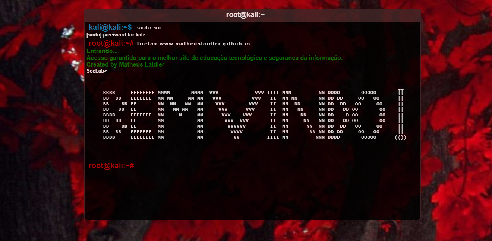

# Terminal HTML Theme

 Apenas uma simples página .HTML que simula um terminal (sem interação direta com teclado) para uma tela de boas vindas. Podendo ser usado para outros fins e para estudos. 
Uma das possibilidades é utilizar esta página em algum CTF (Capture the Flag) que queira montar, com algum contexto e - por exemplo - alguma criptografia no terminal; uma esteganografia na imagem de fundo e entre outras coisas...(para quem é da área de segurança da informação).

Prévias:

 - Terminal Index - Sem redirecionamento: https://matheuslaidler.github.io/Terminal-HTML-Theme/
 

 - Terminal Index - Com redirecionamento via clique: https://matheuslaidler.github.io/Terminal-HTML-Theme/Terminal-Button.html  

 - Terminal Index - Com redirecionamento automático: https://matheuslaidler.github.io/Terminal-HTML-Theme/Terminal-Redirect.html  

## Criação e ideia
 
 Esta página html foi desenvolvida como meio de estudo e revisão de quando eu via front-end. Reutilizando alguns códigos generalizados que se encontra na net e adaptando certas coisas, deu para ter um resultado relativamente bom até.
 A ideia seria fazer, depois, um terminal funcional com javascript, onde a pessoa possa navegar pelo site usando comandos que serão mostrados como um script aberto pelo terminal. Até mesmo navegar tal qual um terminal mesmo, usando comandos como "cd Home" para entrar na home do site e coisas do tipo. Mas isso eu acabei deixando para fazer depois e acabei nem me interessando em fazer, mais futuramente - caso eu faça - postarei aqui com essa atualização, haha.

### Author - Credits

**Matheus Laidler**
- <https://github.com/matheuslaidler>

